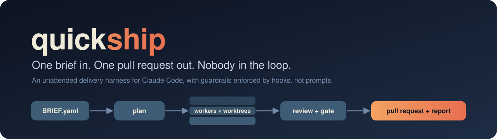
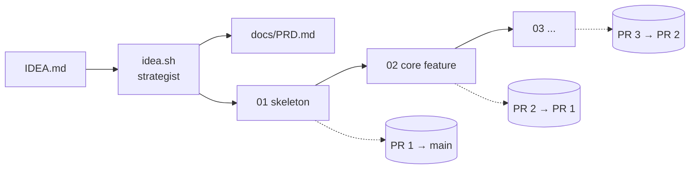
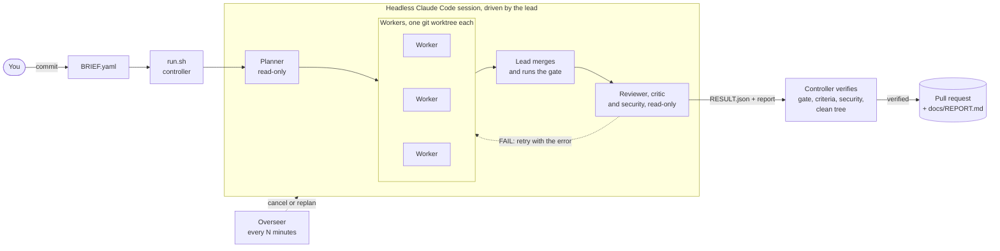
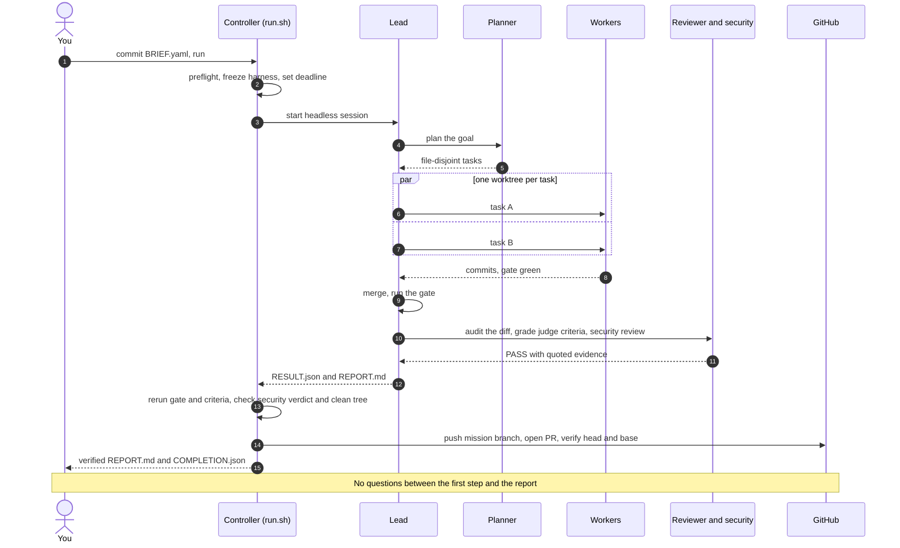
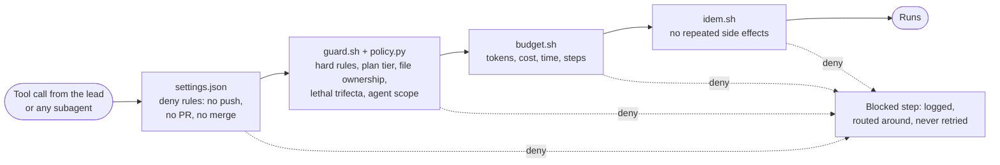
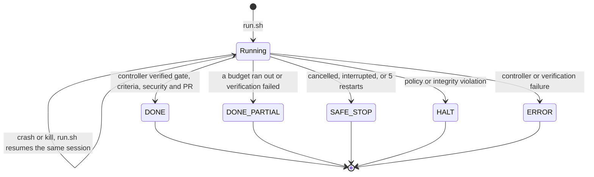

<p align="center">
  
</p>

<p align="center">
  <a href="https://github.com/Jimmycarroll2021/quickship/actions/workflows/tests.yml"></a>
  <a href="https://github.com/Jimmycarroll2021/quickship/releases"></a>
  <a href="LICENSE"></a>
  
  
</p>

**quickship turns Claude Code into an unattended delivery team.** You write a short Mission Brief: the goal, the files you expect, how to tell it is done, and a budget. You run one command and walk away. quickship plans the work, runs parallel workers in git worktrees, merges, reviews and tests their output. A separate controller then checks the result for itself and opens the pull request, with a report. It asks no questions on the way.

You can also start one step earlier. Write a paragraph about your idea, and quickship writes the PRD, splits the MVP into missions and ships them as a stack of pull requests. In one test, a paragraph became a working, tested CLI in 44 minutes, delivered as four pull requests.

Most agent setups stall the moment the model wants a decision, keep going after they should have stopped, or declare success they didn't earn. quickship is built around four rules that make walking away safe:

- **Nobody is asked anything mid-run.** Every ambiguous choice is resolved with a default and written down. Every risky action outside your brief is skipped and written down.
- **Guardrails are enforced, not requested.** Hooks inspect every tool call by the lead and every subagent. Agents can't push, open or merge pull requests, touch secrets or deploy config, or run past hard budgets on cost, time, tokens and steps.
- **Done is verified, not claimed.** An agent saying it is finished counts for nothing. The controller, a separate process the agents can't steer, reruns the gate and your criteria, requires a security pass on the final commit and a clean tree, and only then publishes.
- **Every run ends in a known state.** That state is `DONE`, `DONE_PARTIAL`, `SAFE_STOP`, `HALT` or `ERROR`, with a report that lists what was built, what was assumed, what was blocked and what it cost.

> **quickship is a cooperative development harness, not a security sandbox.** Use it on trusted projects and dependencies in a development checkout. Project scripts, test runners and installers run with your operating-system access. The hooks prevent accidents. They can't make hostile code safe.

## What you write, what you get

You write `BRIEF.yaml` and commit it:

```yaml
mission:
  goal: "Add input validation to the calculator"
  deliverables:
    - src/calculator.js
    - test/calculator.test.js
success_criteria:
  - {kind: test, cmd: "npm test", expect: 0}
  - {kind: file, path: src/calculator.js}
  - {kind: judge, rubric: "Run the tests yourself and quote the summary; PASS only if invalid input is rejected"}
budgets: {tokens: 3000000, cost_usd: 30, wall_clock_min: 45, steps: 160}
```

<sub>Trimmed. A full brief also sets the permissions, the ambiguity policy and the quality checks. See <a href="BRIEF.example.yaml">BRIEF.example.yaml</a> and <a href="#writing-a-brief">Writing a brief</a>.</sub>

You get a pull request, `docs/REPORT.md`, and `docs/COMPLETION.json`, which holds the controller's evidence: gate, criteria, security verdict and the verified PR head. This report excerpt is from a real unattended run made with v0.2. In v0.3 the controller also adds its own verified-outcome heading at the top:

```markdown
## State
DONE

## Criteria
| # | kind  | result | evidence                                                       |
|---|-------|--------|----------------------------------------------------------------|
| 0 | file  | PASS   | check_criteria.py: passed                                      |
| 1 | test  | PASS   | check_criteria.py: passed                                      |
| 2 | judge | PASS   | critic ran `bash tests/diffbase.sh`: 3 passed, 0 failed;        |
|   |       |        | terms at lines 5-10, one sentence each                         |

## Assumptions
- One task was enough; no web research needed.

## Blocked steps
- Reviewer: `cd <dir> && git show ...` denied (cd before git); re-issued as bare commands.

## Budget used
| wall clock | 7.7 / 30 min | steps | 63 / 90 |
```

## Quickstart

**Requirements:**
- Git, Python 3.10 or newer, and bash 4 or newer. The harness needs no Python packages.
- Claude Code 2.1.288 or newer, logged in.
- An authenticated [`gh`](https://cli.github.com).
- A git author identity, and an `origin` that points at github.com.
- For the shell sandbox on Linux or WSL2, `bubblewrap` and `socat` (`apt-get install bubblewrap socat`). macOS needs nothing extra. Without them the run still works, unsandboxed, and preflight says so.

On Windows, bash comes from Git Bash. macOS ships bash 3.2, so install a newer one with `brew install bash`. macOS and cloud sessions aren't release-verified.

```bash
git clone https://github.com/Jimmycarroll2021/quickship
bash quickship/scripts/init.sh ~/my-project      # install the harness into any repo
cd ~/my-project
$EDITOR BRIEF.yaml                               # init.sh seeded it from the example
git status --short                               # commit the harness and the brief, not your secrets
git add BRIEF.yaml .claude/agents .claude/rules .claude/settings.json scripts tests .quickship
git add CLAUDE.md VERSION .gitattributes .gitignore run.cmd init.cmd idea.cmd program.cmd
git add BRIEF.example.yaml IDEA.example.md docs/design/contracts.md docs/PRD_TEMPLATE.md docs/decisions.md
git add .github/pull_request_template.md
git commit -m "Install quickship and mission brief"
python scripts/preflight.py                      # checks auth and setup, no model calls
bash scripts/run.sh                              # walk away
cat docs/REPORT.md                               # come back
```

The installed harness and `BRIEF.yaml` must be committed, so every task worktree gets the same safeguards. If `init.sh` left anything in `.quickship/conflicts`, resolve it before you launch.

Or start from an idea instead of a brief:

```bash
cp IDEA.example.md IDEA.md && $EDITOR IDEA.md   # one paragraph: who it's for, what it does
bash scripts/idea.sh                            # PRD + 2 to 5 mission briefs; read the PRD
bash scripts/program.sh                         # runs the missions; you merge the PR stack
```

On Windows, open PowerShell and run `quickship\init.cmd C:\path\to\my-project`. Then use `.\run.cmd`, `.\idea.cmd` or `.\program.cmd` in the project. The wrappers find Git Bash for you. Claude's own PowerShell tool is disabled inside missions.

## From idea to MVP

A single brief gets you a single pull request. To go from a raw idea to an MVP, let quickship write the briefs too.

`idea.sh` runs a strategist agent once. It pressure-tests the idea, writes a short PRD with the riskiest assumptions and the smallest useful scope, and splits the MVP into sequenced missions. Each mission has testable criteria. `program.sh` then runs the missions one after another. Each mission branches off the previous one, so the pull requests form a stack. You review and merge them in order, first one first.



The chain moves on only when a mission's controller exits 0 with a verified `DONE`. A mission that crashed is retried in place. Any other outcome stops the chain: read its report, fix the brief, and re-run `program.sh`. Missions that already finished are skipped. Read the PRD before you start the chain, because it is the cheapest place to catch a wrong assumption.

## How it works



1. **Brief.** `run.sh` starts the controller. It runs preflight checks on authentication, the brief and the committed harness. A broken setup fails here, before any tokens are spent.
2. **Plan.** A planner subagent splits the goal into tasks that touch separate files. It works in a read-only tier, so planning can't change anything.
3. **Build.** Each task goes to a worker in its own git worktree, and independent tasks run in parallel. A worker may write only the files its task owns. Workers have no web access. A separate researcher subagent reads the web, but it has no shell and can write only its own findings file.
4. **Integrate.** The lead merges each task branch, a read-only reviewer audits the diff, and `scripts/gate.sh` runs a secrets scan, lint, tests and build. A code change without a test is a review failure. A failure goes back to the worker with the error, at most three times.
5. **Check.** `check_criteria.py` runs your `test`, `file` and `grep` criteria. Failures become new tasks while budget remains. The reviewer then acts as critic and grades each `judge` rubric on command output it produced itself, never on the worker's claims. A read-only security reviewer checks the mission's diff, and its high and medium findings become tasks too. For UI work, put a Playwright command in a `test` criterion and it becomes a browser check.
6. **Verify and ship.** The lead submits `docs/RESULT.json` and its report, then stops. The controller checks everything again on its own:
   - it reruns the gate and the objective criteria
   - it requires every deliverable and evidenced judge grades
   - it requires a security pass for the final commit and a clean tree
   Only then does it push the `mission/*` branch, open the pull request, and confirm the remote head and base. You review and merge.

A run, step by step:



## Guardrails that hold when nobody is watching

Prompts can be ignored, but hooks can't. quickship commits its rules to the repo in `.claude/settings.json` and `scripts/hooks/`. The controller freezes a copy of them for each run, so an agent can't edit its own guardrails mid-mission. Every tool call passes through the same layers, and nothing reaches GitHub without the controller's own checks:



What the agents will never do:

- Push, open or merge a pull request. Only the controller publishes, and only after it has checked the result. It never merges: you do.
- Push to `main` or `master`, force-push, rebase shared branches or rewrite published history.
- Run `git reset --hard`, `git branch -D`, `rm -rf` or `pip install`.
- Touch `.env*` files other than `*.example`, hosting config, deploy Dockerfiles, `infra/`, `terraform/`, `k8s/`, or deploy workflows.
- Write files their task doesn't own, or use external MCP connectors.
- Commit a secret. The gate scans tracked and untracked files for key formats.
- Let one step both read untrusted web content and push or open a pull request. This is the [lethal trifecta](https://simonwillison.net/2025/Jun/16/the-lethal-trifecta/) rule.
- Run past a budget. Once a limit is reached, only the result and the report can be written.

- Run a command outside the run's allowlist. In a controller run the shell is restricted to a base set (inspection, git and gh, the package managers and test runners the gate drives) plus whatever the brief's `quality` commands and `test` criteria name. Anything else is refused by name, so a new tool is a brief change, not a surprise.

Agent shell commands also run inside Claude Code's own OS sandbox on macOS, Linux and WSL2: writes stay inside the project, the network is limited to GitHub and the npm and PyPI registries, and the unsandboxed retry is disabled. Native Windows runs commands unsandboxed, and `preflight.py` reports which you have under `sandbox`. The hooks themselves remain cooperative: project scripts, test runners and dependency installers run with whatever the sandbox allows, and a hostile project still needs isolation and restricted credentials beyond this.

## Every run ends in exactly one state



| State | Meaning | `run.sh` exit code |
|---|---|---|
| `DONE` | Every final check passed and the actual PR was verified | 0 |
| `DONE_PARTIAL` | A budget, a policy or a failed verification stopped completion | 3 |
| `SAFE_STOP` | Cancelled, interrupted, or the restart limit was reached | 3 |
| `HALT` | A policy or integrity violation | 4 |
| `ERROR` | The controller or its verification failed | 5 |

An invalid setup or brief exits 2 before any model work. Only the controller writes `docs/RUN_STATE` and `docs/COMPLETION.json`. A successful Claude exit or an agent claiming success is never enough. A partial run may have no PR, and its report says why. Re-running a verified `DONE` doesn't publish again.

## Track record

These missions ran unattended on real repos. The figures were recomputed from the full session transcripts, lead plus every subagent, using the harness's own `budget.py`. The rows above the last one predate v0.3, so they used the older guard, budget and completion rules.

| Mission | Outcome | Time | Tool calls | Tokens: uncached + cache reads |
|---|---|---|---|---|
| Write quickship's own first README | `DONE`, PR opened | 40 min | 84 | 0.24M + 3.0M |
| Same goal with `steps: 12` | `DONE_PARTIAL`, report lists the gap | 5 min | 26 | 0.09M + 0.7M |
| Same goal, lead killed mid-task, then re-run | `DONE`, exactly one push and one PR | 11 min | 70 | 0.17M + 2.0M |
| Same goal in a `claude --cloud` session | `DONE`, PR opened with the GitHub tool | not measured | 26 | not measured |
| A CPU-only private RAG app over three PDFs (llama.cpp, GGUF, sqlite) | `DONE`, PR with 2,134 lines. The lead added a fourth task after a weak eval | 72 min | 288 | 0.68M + 12.9M |
| A docs task in a project installed by `init.sh` | `DONE_PARTIAL`. It hit its 30-minute limit after losing about 10 minutes to permission denials | 30 min | 82 | 0.20M + 2.7M |
| The same kind of task after the v0.1.0 fixes | `DONE`. The judge was graded on the critic's own test run | 9 min | 74 | 0.14M + 2.8M |
| **Idea to MVP:** a paragraph about an offline GPX ride-summary CLI through `idea.sh` and `program.sh` | PRD, 4 missions, all `DONE`, a stack of 4 PRs (+1,618 lines, 46 tests). The security reviewer caught one finding, which was fixed before the PR | 44 min | 563 | 1.22M + 14.5M |
| **v0.3 acceptance:** three missions in a private synthetic Node repo, one interrupted by a forced crash | All `DONE` after the controller's checks, including a two-PR stack. The crashed mission kept its session, deadline and worker commit and resumed. A rerun made no model calls and no duplicate PRs | not published | not published | not published |

The leads ran on Claude Fable 5.1 and Opus, and the workers and reviewers on Sonnet. What you pay depends on your model and plan. The RAG app and the v0.3 acceptance runs were built in private repos. Their briefs and constraints are in [examples/briefs/](examples/briefs/), and the v0.3 evidence, including what wasn't tested, is in [docs/RELEASE-EVIDENCE.md](docs/RELEASE-EVIDENCE.md).

The failures are listed on purpose, because each one became a fix. The fixes are recorded in [CHANGELOG.md](CHANGELOG.md). One run is archived in full in [docs/runs/](docs/runs/), with its plan, ledgers and report.

## Is it for you?

**Good fit:** well-scoped work you can describe in a paragraph and check with a command. That covers features with tests, docs, refactors behind a test suite, small apps and tooling, on projects you trust. It also suits overnight or background work where you'd rather review a pull request than supervise a chat.

**Poor fit:** work that needs judgement calls only you can make, such as product decisions, design taste or anything touching production. quickship is built to refuse anything that touches production. Untrusted repositories or dependencies are also a poor fit, because the hooks are not a sandbox. So is exploratory work with no testable definition of done.

**Costs:** every step is a model call. A one-file mission takes 70 to 85 tool calls and 9 to 40 minutes. It uses about 0.15M to 0.25M uncached tokens plus 2M to 3M cache reads. Most of the time goes on model round trips, so a faster machine doesn't help. Set `cost_usd` and `wall_clock_min` in the brief, because those are the limits that usually bite.

## Writing a brief

`BRIEF.example.yaml` is annotated, and `examples/briefs/` has briefs from real runs. Check a brief without starting a run:

```bash
python3 scripts/brief.py check BRIEF.yaml
```

| Field | Meaning |
|---|---|
| `mission.goal` | One or two sentences: what to build or change. |
| `mission.deliverables` | Files or outputs the mission must produce. |
| `success_criteria` | Checks that decide "done", see below. |
| `budgets` | `tokens`, `cost_usd`, `wall_clock_min` and `steps` are required. `stall_limit`, `replan_limit` and `critic_rounds` are optional counts, defaulting to 3, 5 and 2. |
| `permissions.irreversible` | `default: skip-and-record`, plus an `allow` list of shell globs such as `"git push origin mission/*"` and `"gh pr create*"`. The controller checks these before publishing. They can never override a hard rule. |
| `ambiguity_policy` | Always `choose-default-and-record`. |
| `quality` | Optional. `profile: code` or `docs`, plus `lint`, `test` and `build` commands or a `skip:` reason for each. |

| Criterion kind | Fields | Passes when |
|---|---|---|
| `test` | `cmd`, `expect` (exit code, default 0) | the command exits with that code |
| `file` | `path`, optional `must_contain` regex | the file exists and the regex matches |
| `grep` | `pattern`, `path` | the regex matches in the file |
| `judge` | `rubric` | the critic grades it PASS on evidence it produced itself |

**Quality checks.** For Node, the gate runs the package manager's `lint`, `test` and `build` scripts. For Python, it runs Ruff, pytest, and a build when `pyproject.toml` declares a build system. A missing check fails unless the brief's `quality` block gives a command or an explicit skip reason, for example:

```yaml
quality:
  profile: code
  lint: "npm run lint"
  test: "npm test"
  build:
    skip: "This source-only library has no build artifact"
```

Other stacks need explicit `quality` entries. For documentation missions, set `profile: docs`, and the gate then rejects application-code changes. Install your project's tools before launching.

**Budgets.** The `steps` budget counts every tool call, subagents included, so keep it at 90 or more for a small mission. The `tokens` budget counts input, output and cache-creation tokens across the lead, every subagent and the overseer. It reports cache reads separately. On a Claude Pro or Max plan, `cost_usd` caps an estimated API-equivalent amount, not your bill. quickship never changes billing settings, adds credits or switches authentication. On API authentication the controller also passes the remaining dollar budget to Claude Code. In-flight calls can still overshoot a limit slightly.

<details>
<summary><b>FAQ</b></summary>

**The run prints `Ignoring N permissions.allow entries ... not been trusted`.** This is expected on a folder you never opened interactively. The controller passes its own frozen settings and allow list. Deny rules and hooks still apply.

**In PowerShell, `bash scripts/run.sh` fails with `execvpe(/bin/bash) failed`.** Plain `bash` in PowerShell is the WSL stub. Use `.\run.cmd`, `.\idea.cmd` and `.\program.cmd`, or open Git Bash.

**The run crashed, or I closed the terminal.** Run `bash scripts/run.sh` again. The controller keeps the session, the ledgers and the original deadline, and it resumes. If the saved session is gone, it says so rather than quietly starting a duplicate mission.

**The agent said it was done, so why is the state `DONE_PARTIAL`?** The controller reran the checks and something failed: a criterion, the gate, the security verdict on the final commit, or a dirty tree. `docs/COMPLETION.json` says which.

**How do I stop a run?** Create the cancel flag with `touch .claude/state/cancel`. The run ends in `SAFE_STOP` and still writes its report. Archive the run before you start again.

**How do I change the brief or start a new mission?** Changing the brief of a run that has started is refused. Raising a budget is the exception: if only the `budgets` block changes, the same run continues with the new limits. For anything else, run `bash scripts/run.sh --archive`. That moves the finished run into `docs/runs/`; an unfinished run is refused until you cancel it (see the [runbook](docs/RUNBOOK.md#cancel-by-hand)). Then edit and commit `BRIEF.yaml` and run again. After a verified `DONE`, a brief with a new goal starts fresh automatically.

**Can it run in the cloud?** Earlier versions ran in a `claude --cloud` session. v0.3's controller isn't release-verified there yet.

**Does it use my API key or my subscription?** It uses whatever your `claude` CLI is logged in with. quickship makes no model calls of its own. On a subscription, check that extra paid usage is disabled if you want to stay within your plan.

**How do I upgrade the harness in a project?** Pull quickship, then run `bash quickship/scripts/init.sh ~/my-project --upgrade`. This refreshes only the harness files you never edited. Modified files and a custom `CLAUDE.md` or settings are kept, and the differences are listed in `.quickship/conflicts`. Don't upgrade during an active run.

More in [docs/RUNBOOK.md](docs/RUNBOOK.md).
</details>

<details>
<summary><b>Environment variables</b></summary>

| Variable | Effect |
|---|---|
| `QS_PYTHON` | Python for every script and hook (default `python3`, else `python`). |
| `QS_OVERSEER` | `0` disables the overseer (default `1`). |
| `QS_OVERSEER_MIN` | Overseer interval in minutes (default 15). |
| `QS_SLEEP` | Seconds to wait before a restart, overriding exponential backoff. |
| `QS_SELFTEST` | `1` makes the gate run the harness self-tests in an installed project. |
| `QS_TEST_JOBS` | Parallel self-test files, integer 1–1024 (default: 1 on Windows; at most 4 elsewhere). Installed-copy tests inherit it. |
| `QS_TEST_LOG_DIR` | Optional local directory for retained per-script logs and exit codes; each suite gets its own subdirectory. Logs can contain private project information. |
| `QS_NO_YAML` | `1` forces the built-in YAML reader even when PyYAML is installed. |
</details>

<details>
<summary><b>Project layout</b></summary>

| Path | What it is |
|---|---|
| `CLAUDE.md` | The agent contract: hard rules, subagents and the lead loop. |
| `BRIEF.example.yaml`, `IDEA.example.md` | Annotated example brief and idea. |
| `scripts/run.sh`, `run.cmd` | Launch, resume or archive a mission through the controller (`scripts/runner.py`). |
| `scripts/idea.sh`, `idea.cmd` | Turn `IDEA.md` into a PRD and mission briefs. |
| `scripts/program.sh`, `program.cmd` | Run the mission briefs in order as a stack of PRs. |
| `scripts/init.sh`, `init.cmd` | Install or upgrade the harness in a project. |
| `scripts/preflight.py` | Setup, authentication and capability checks, with no model calls. |
| `scripts/gate.sh`, `scripts/quality.py` | The definition of done: secrets, lint, tests, build. |
| `scripts/policy.py`, `scripts/runtime.py` | Command policy and the controller's state store. |
| `scripts/*.py` | Brief validation, ledgers, budgets, criteria, overseer status. Standard library only. |
| `scripts/hooks/` | `guard`, `budget`, `idem`, `anchor`, `stop` and `agents` hooks, wired in `.claude/settings.json`. |
| `.claude/agents/` | Strategist, planner, worker, researcher, reviewer, security and overseer subagents. |
| `tests/` | Self-tests with no model calls. `bash tests/run.sh` runs them all. |
| `docs/design/contracts.md` | The contract for every file, script and hook. |
| `docs/PRD_TEMPLATE.md`, `.github/pull_request_template.md` | The PRD shape the strategist fills in, and the PR body the controller renders. |
| `docs/RUNBOOK.md` | Operating a run: state, resume, cancel, archive, budgets, failures. |
| `docs/RELEASE-EVIDENCE.md` | What the current release was tested on, and what it wasn't. |
| `examples/briefs/` | Briefs from real runs. |
</details>

## Design notes

quickship borrows from published agent-design work:
- **Ledgers:** the task and progress ledgers, with stall detection and bounded replanning, follow Microsoft Research's [Magentic-One](https://www.microsoft.com/en-us/research/articles/magentic-one-a-generalist-multi-agent-system-for-solving-complex-tasks/) orchestrator.
- **Untrusted reading:** the rule that keeps untrusted reading apart from outbound actions comes from Simon Willison's lethal trifecta.
- **Critic:** grading by a critic that gathers its own evidence is the evaluator-optimizer pattern, with one addition: a grade without quoted command output doesn't count.
- **Separation of duties:** v0.3 adds this. The agents do the work, and a separate controller decides whether it is done and publishes it.

[docs/design/contracts.md](docs/design/contracts.md) has every interface, and [tasks/prd-quickship.md](tasks/prd-quickship.md) has the original requirements.

## Contributing

Issues and pull requests are welcome. The self-tests make no model calls and run in a few minutes:

```bash
bash tests/run.sh
```

CI runs them on Ubuntu and Windows with Python 3.10 and 3.12. Passing simulated tests alone doesn't prove real delivery, which is why [docs/RELEASE-EVIDENCE.md](docs/RELEASE-EVIDENCE.md) records the live runs separately. See [CONTRIBUTING.md](CONTRIBUTING.md) for how changes are tested and what makes a good bug report. A brief that misbehaved is the most useful thing you can send.

## Licence

[MIT](LICENSE).
