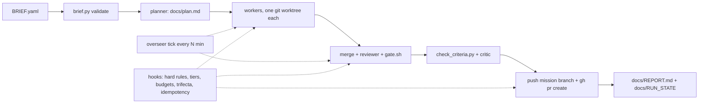

# quickship

quickship is a Claude Code harness for unattended software delivery. A human writes one Mission Brief (`BRIEF.yaml`), runs one command, and later reads one report (`docs/REPORT.md`) and a pull request. Nobody answers questions mid-run: every ambiguous choice is resolved with a default and written down, every irreversible action outside the brief's allow list is skipped and written down, and every run ends in exactly one of four terminal states.

Version: `VERSION` = 0.1.0. See [CHANGELOG.md](CHANGELOG.md).

## Quickstart

```bash
git clone https://github.com/Jimmycarroll2021/quickship
bash quickship/scripts/init.sh ~/my-project     # Windows PowerShell: quickship\init.cmd C:\path\to\my-project
cd ~/my-project
# edit BRIEF.yaml (init.sh copied BRIEF.example.yaml there)
git add BRIEF.yaml && git commit -m "mission brief"
bash scripts/run.sh                             # Windows PowerShell: .\run.cmd
# ... walk away ...
cat docs/REPORT.md
```

`init.sh` copies the harness files listed in `scripts/manifest.txt` into the target, runs `git init` if the target is not a repo, appends the three gitignore lines the harness needs, creates `docs/decisions.md` and `BRIEF.yaml`, and records what it installed under `.quickship/` (including `.quickship/VERSION`). Re-run with `--upgrade` after pulling a newer quickship to refresh harness files you never edited; `--force` overwrites everything except `CLAUDE.md`.

`run.sh` validates the brief, starts the lead Claude session headlessly with the repo's allow list, starts the overseer beside it, and returns when the lead returns. If the run stopped without a terminal state, run it again: it resumes the same session.

## Requirements

- `git`.
- Python 3.10 or newer on `PATH` as `python3` or `python` (or set `QS_PYTHON`). The scripts use only the standard library; PyYAML is used if installed.
- The `claude` CLI, installed and logged in. `run.sh` calls `claude -p`.
- `gh` (GitHub CLI), authenticated, for the final PR step in local runs. A `claude --cloud` session has no `gh` and uses the GitHub tool instead.
- bash. On Windows that is Git Bash; `run.cmd` and `init.cmd` find it for you.

## How a run works



1. **Brief.** `scripts/brief.py validate` turns `BRIEF.yaml` into `.claude/state/brief.json`, or exits 2 naming the bad key.
2. **Plan.** The lead creates the session branch `mission/<goal-slug>` and a planner subagent splits the goal into file-disjoint tasks in `docs/plan.md` and the task ledger. Planning runs in a read-only tier.
3. **Workers.** Each task goes to a worker subagent in its own git worktree under `.claude/worktrees/`. Independent tasks run in parallel. Workers have no web tools; a separate researcher subagent answers web questions and cannot run commands or push.
4. **Integrate.** The lead merges each task branch with `--no-ff`, a read-only reviewer audits the diff, and `bash scripts/gate.sh` runs (secrets scan, lint, tests, build, plus the harness self-tests). A failure is retried with the error in context, at most three times.
5. **Criteria and critic.** `scripts/check_criteria.py` runs every `test`, `file` and `grep` criterion. Failures become new tasks, at most `critic_rounds` times. The reviewer then grades each `judge` rubric PASS or FAIL; it may run the brief's test commands and the project's own eval to do so.
6. **Push and PR.** The lead pushes the session branch and opens a PR. Both are idempotent: a repeat of either in the same step is denied by the hook and the recorded result stands.
7. **Report.** The lead writes `docs/REPORT.md` and one line of JSON to `docs/RUN_STATE`, then stops. The Stop hook refuses to end an active run without a terminal state.

Beside the lead, the **overseer** runs a separate read-only `claude -p` every `QS_OVERSEER_MIN` minutes. It reads the ledgers and `scripts/overseer_status.py`, appends a note to `docs/overseer.md`, and can create `.claude/state/force_replan` (last three progress lines identical) or `.claude/state/cancel` (replan limit hit, no progress for 45 minutes, or the same denied command five times in a row).

The **hooks** in `scripts/hooks/` run on every tool call inside the lead and its subagents, enforce the hard rules (see below), confine the plan tier to reads, count steps and deny work once a budget is exhausted, prevent one step from both reading untrusted content and sending data out (the lethal-trifecta rule), and make pushes and PR creation idempotent.

## BRIEF.yaml

Copy `BRIEF.example.yaml` (`init.sh` does this) and edit. All fields are required unless marked otherwise.

| Field | Meaning |
|---|---|
| `mission.goal` | One or two sentences: what to build or change. |
| `mission.deliverables` | List of files or outputs the mission must produce (non-empty). |
| `success_criteria` | Non-empty list of checks that decide "done". Each has a `kind`, see below. |
| `budgets` | Limits that stop the run: `tokens`, `cost_usd`, `wall_clock_min`, `steps` (all numbers > 0). Optional counts: `stall_limit` (default 3), `replan_limit` (5), `critic_rounds` (2). |
| `permissions.irreversible.default` | `skip-and-record` (do not run the action, log it as blocked) or `allow`. |
| `permissions.irreversible.allow` | Optional list of shell-glob patterns permitted even under `skip-and-record`, e.g. `"git push origin mission/*"`. |
| `ambiguity_policy` | Must be `choose-default-and-record`: pick a sensible default and log it as an assumption. |

Success criteria kinds:

| Kind | Fields | Passes when |
|---|---|---|
| `test` | `cmd`, `expect` (exit code, default 0) | the command exits with the expected code (600 s timeout) |
| `file` | `path`, optional `must_contain` (regex) | the file exists (and the regex matches) |
| `grep` | `pattern`, `path` | the regex matches in the file |
| `judge` | `rubric` | the reviewer, acting as critic, grades the rubric PASS |

Budget notes. `steps` counts every tool call in the run, subagents included; a one-file mission uses about 70, so keep it at 60 or more. `tokens` counts input, output and cache-creation tokens and excludes cache reads (reported separately as `cache_read_tokens`, with `tokens_total` for the sum), so it is a backstop; `cost_usd` and `wall_clock_min` are the caps that usually bite.

YAML notes. Without PyYAML a strict built-in reader is used: 2-space indentation, scalar values, lists of scalars, lists of single-line `{key: value}` flow maps, strings in double quotes, no anchors, no multi-line scalars, no colons inside a `cmd` string. Check a brief without starting anything:

```bash
python3 scripts/brief.py validate
```

Worked briefs are in `examples/briefs/`.

## Terminal states

`docs/RUN_STATE` is one line of JSON: `{"state": "...", "reason": "...", "at": "<iso utc>"}`.

| State | Meaning |
|---|---|
| `DONE` | Criteria met, gate passed, PR opened. |
| `DONE_PARTIAL` | A budget ran out first. The PR title is tagged `[partial]`; the report lists the gaps. |
| `SAFE_STOP` | Cancelled, replan limit hit, or restart limit (5) reached. A report is still written. |
| `HALT` | Policy violation such as a committed secret. Synthesis is skipped. |

## What it will not do

Enforced by `.claude/settings.json` deny rules and the `scripts/hooks/guard.sh` hook, so they hold in cloud sessions and fresh clones:

- Never merges PRs. You merge.
- Never pushes to `main` or `master`; work stays on `mission/*` branches.
- Never force-pushes, rebases shared branches, or rewrites published history.
- Never runs `git reset --hard`, `git branch -D`, `git checkout -- <file>`, `rm -rf` or `pip install`.
- Never reads, writes or commits `.env*` (except `*.example`), hosting config (`vercel.json`, `fly.toml`, `netlify.toml`), deploy Dockerfiles, `infra/`, `terraform/`, `k8s/`, or a workflow file with `deploy` in its name.
- Never commits secrets: the gate scans tracked and untracked files for key formats.
- Never lets one step both read untrusted content and push or open a PR.

A denied action is recorded as a blocked step in `docs/decisions.md` and routed around, never retried.

## Observed runs

Unattended missions run with this harness so far (cost from the budget hook, USD):

| Mission | Outcome | Time | Steps | Cost |
|---|---|---|---|---|
| Add a README to quickship itself | `DONE`, PR opened | 37 min | 72 | ~$4.56 |
| Same goal with `steps: 12` | `DONE_PARTIAL`, report written | ~5 min | 12 | ~$1.68 |
| Same goal, lead killed mid-task, `run.sh` re-run | `DONE`; one push and one PR in `idem.jsonl` | not recorded | not recorded | ~$1.59 |
| Same goal in a `claude --cloud` session | `DONE`, PR opened via the GitHub tool | not recorded | 26 | ~$1.24 |
| localrag: CPU-only private RAG over three PDFs (llama.cpp, GGUF, sqlite), 4 tasks | `DONE`, PR with 2,134 lines added | 96 min | 257 | ~$3.40 |

In the localrag run the lead added the fourth task itself after a weak eval result. The brief is in `examples/briefs/localrag-mission.yaml`.

## FAQ

**The run prints `Ignoring N permissions.allow entries ... workspace has not been trusted`.** Expected on a folder that was never trusted interactively. Headless Claude Code ignores project allow rules there, so `run.sh` passes the same list via `--allowedTools`. Deny rules and hooks still apply.

**From PowerShell, `bash scripts/run.sh` fails with `execvpe(/bin/bash) failed`.** Plain `bash` in PowerShell is the WSL stub. Use `.\run.cmd` and `.\init.cmd`, which locate Git Bash, or open a Git Bash terminal.

**Windows paths.** Hooks normalise backslash paths, `run.sh` sets `core.longpaths`, and task slugs are capped at 24 characters. Pass `init.cmd` a normal Windows path.

**The lead was denied `cd <dir> && git ...`.** Claude Code auto-denies a `cd` before any git command in an unattended session. The harness and its agents use `git -C <dir> ...` instead; the guard denies the `cd` form up front with that fix in the reason.

**Cloud sessions.** A `claude --cloud` session clones the pushed branch, so `BRIEF.yaml` must be committed. The cloud VM has no `gh`; the lead opens the PR through the GitHub tool, which the idempotency hook also covers. Cloud sessions assign their own `claude/*` branch, which then serves as the session branch.

**Resuming.** Run `bash scripts/run.sh` again. It resumes by session id, or rebuilds from the ledgers if the session is gone, with exponential backoff and `SAFE_STOP` after five restarts. Pushes and PRs already recorded in `.claude/state/idem.jsonl` are not repeated.

**Cancelling.** `touch .claude/state/cancel`. The guard then allows only reads and the report, and the lead ends in `SAFE_STOP` with `docs/REPORT.md` written. Details in [docs/RUNBOOK.md](docs/RUNBOOK.md).

**Starting a new mission in the same repo.** Edit `BRIEF.yaml` and run `run.sh`. The previous run's report, state and ledgers are moved to `docs/runs/<at>-<slug>/` automatically when the goal differs.

## Environment variables

| Variable | Effect |
|---|---|
| `QS_PYTHON` | Python interpreter for every script and hook (default: `python3`, else `python`). |
| `QS_OVERSEER` | `0` disables the overseer (default `1`). |
| `QS_OVERSEER_MIN` | Overseer interval in minutes (default 15). |
| `QS_SLEEP` | Seconds to wait before a restart, overriding the exponential backoff. |
| `QS_TEST_JOBS` | How many self-test files `tests/run.sh` runs in parallel (default: CPU count, else 4). |
| `QS_NO_YAML` | `1` forces the built-in YAML reader even when PyYAML is installed. |

## Project layout

| Path | What it is |
|---|---|
| `BRIEF.example.yaml` | Annotated example Mission Brief; `init.sh` copies it to `BRIEF.yaml`. |
| `CLAUDE.md` | The agent contract: hard rules, subagents, and the lead loop the session follows. |
| `VERSION` | Harness version, copied to `.quickship/VERSION` in installed projects. |
| `run.cmd`, `init.cmd` | Windows wrappers that locate Git Bash and run the matching script. |
| `scripts/` | `run.sh` (launch or resume), `init.sh` (install or upgrade), `gate.sh` (definition of done), `brief.py`, `ledger.py`, `budget.py`, `check_criteria.py`, `overseer.sh`, `overseer_status.py`, `diffbase.sh`, `manifest.txt`. |
| `scripts/hooks/` | `guard.sh`, `budget.sh`, `idem.sh`, `anchor.sh`, `stop.sh`: the hooks wired in `.claude/settings.json`. |
| `.claude/agents/` | Subagent definitions: planner, worker, researcher, reviewer, overseer. |
| `.claude/settings.json` | Allow and deny rules plus the hook wiring; committed so it applies in fresh clones. |
| `.claude/rules/` | Path-scoped rules (no secrets in tracked files). |
| `tests/` | Harness self-tests, no LLM calls; `bash tests/run.sh` runs them all. The gate runs them in the quickship repo itself; in an installed copy it skips them (they take minutes and test the harness, not your project), so run them once after `init.sh` or `--upgrade`, or set `QS_SELFTEST=1`. |
| `examples/briefs/` | Worked briefs from real runs. |
| `docs/design/contracts.md` | Contract for every file, script and hook. |
| `docs/decisions.md` | Append-only decision log, one row per merge, assumption or blocked step. |
| `docs/runs/` | Archived reports, plans and ledgers from finished missions. |
| `docs/RUNBOOK.md` | Operating a run: state files, resume, cancel, replan, budgets, failures. |
| `tasks/prd-quickship.md` | The product requirements document. |
| `.github/workflows/tests.yml` | CI: the self-tests on Ubuntu and Windows. |

## Links

- [docs/RUNBOOK.md](docs/RUNBOOK.md): operating a run.
- [docs/design/contracts.md](docs/design/contracts.md): runtime contracts.
- [tasks/prd-quickship.md](tasks/prd-quickship.md): requirements.
- [CHANGELOG.md](CHANGELOG.md): release history.
- [LICENSE](LICENSE): MIT.
