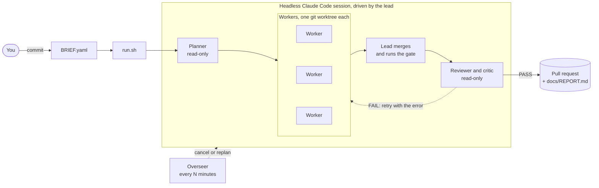
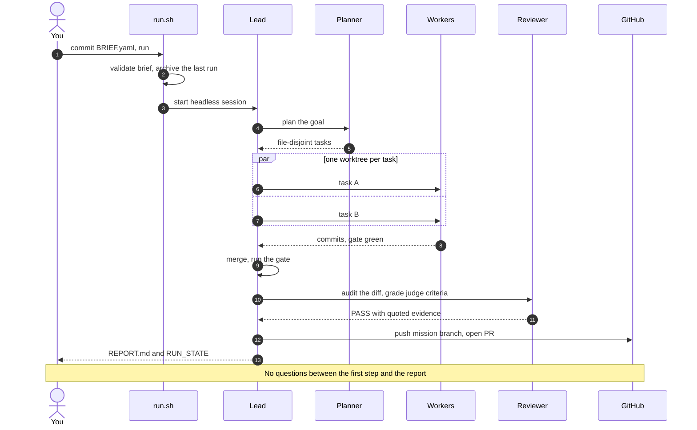
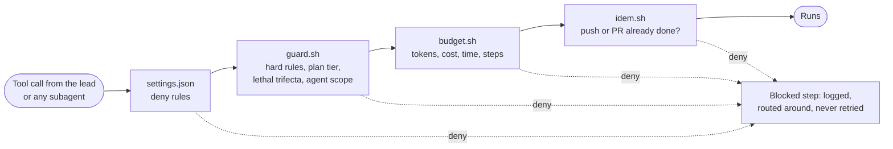
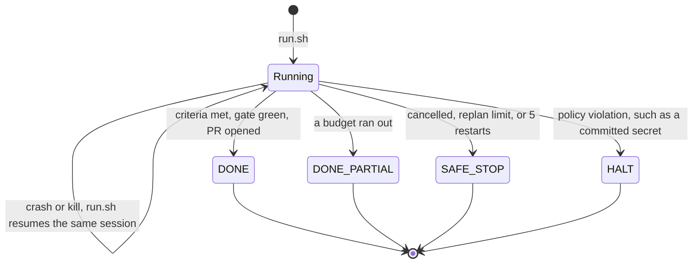

<p align="center">
  
</p>

<p align="center">
  <a href="https://github.com/Jimmycarroll2021/quickship/actions/workflows/tests.yml"></a>
  <a href="https://github.com/Jimmycarroll2021/quickship/releases"></a>
  <a href="LICENSE"></a>
  
  
</p>

**quickship turns Claude Code into an unattended delivery team.** You write a short Mission Brief: the goal, the files you expect, how to tell it is done, and a budget. You run one command and walk away. quickship plans the work, runs parallel workers in git worktrees, merges, reviews and tests their output, and opens a pull request with a report. It asks no questions on the way.

Most agent setups stall the moment the model wants a decision, or keep going after they should have stopped. quickship is built around three rules that make walking away safe:

- **Nobody is asked anything mid-run.** Every ambiguous choice is resolved with a default and written down. Every risky action outside your brief is skipped and written down.
- **Guardrails are enforced, not requested.** Hooks inspect every tool call by the lead and every subagent. No merging, no pushing to `main`, no force-push, no secrets, no deploy config, and hard budgets on cost, time, tokens and steps.
- **Every run ends in a known state.** That state is `DONE`, `DONE_PARTIAL`, `SAFE_STOP` or `HALT`, with a report that lists what was built, what was assumed, what was blocked and what it cost.

## What you write, what you get

You write `BRIEF.yaml` and commit it:

```yaml
mission:
  goal: "Add docs/GLOSSARY.md defining six project terms, one sentence each"
  deliverables:
    - docs/GLOSSARY.md
success_criteria:
  - {kind: file, path: docs/GLOSSARY.md, must_contain: "ledger"}
  - {kind: test, cmd: "bash tests/diffbase.sh", expect: 0}
  - {kind: judge, rubric: "Run the tests yourself and quote the summary; PASS only if all six terms are defined"}
budgets: {tokens: 2000000, cost_usd: 20, wall_clock_min: 30, steps: 90}
```

<sub>Trimmed. A full brief also sets the permissions and ambiguity policy. See <a href="BRIEF.example.yaml">BRIEF.example.yaml</a>.</sub>

You get a pull request and `docs/REPORT.md`. This excerpt is from a real unattended run:

```markdown
## State
DONE

## Criteria
| # | kind  | result | evidence                                                       |
|---|-------|--------|----------------------------------------------------------------|
| 0 | file  | PASS   | check_criteria.py: passed                                      |
| 1 | test  | PASS   | check_criteria.py: passed                                      |
| 2 | judge | PASS   | critic ran `bash tests/diffbase.sh`: 3 passed, 0 failed;        |
|   |       |        | terms at lines 5-10, one sentence each                         |

## Assumptions
- One task was enough; no web research needed.

## Blocked steps
- Reviewer: `cd <dir> && git show ...` denied (cd before git); re-issued as bare commands.

## Budget used
| wall clock | 7.7 / 30 min | steps | 63 / 90 |
```

## Quickstart

```bash
git clone https://github.com/Jimmycarroll2021/quickship
bash quickship/scripts/init.sh ~/my-project     # install the harness into any repo
cd ~/my-project
$EDITOR BRIEF.yaml                              # init.sh seeded it from the example
git add BRIEF.yaml && git commit -m "mission brief"
bash scripts/run.sh                             # walk away
cat docs/REPORT.md                              # come back
```

On Windows, open PowerShell and run `quickship\init.cmd C:\path\to\my-project`, then `.\run.cmd` in the project. Both wrappers find Git Bash for you.

**Requirements:** `git`, Python 3.10 or newer, which needs only the standard library, the [`claude` CLI](https://docs.claude.com/en/docs/claude-code) logged in, and an authenticated [`gh`](https://cli.github.com) for the pull request step. You also need bash 4 or newer. On Windows that is Git Bash. macOS ships bash 3.2, so install a newer one with `brew install bash`. macOS isn't covered by CI yet.

## How it works



1. **Brief.** `run.sh` validates `BRIEF.yaml` and starts the lead headlessly. A broken brief fails here, before any tokens are spent.
2. **Plan.** A planner subagent splits the goal into tasks that touch separate files. It works in a read-only tier, so planning cannot change anything.
3. **Build.** Each task goes to a worker in its own git worktree, and independent tasks run in parallel. Workers have no web access. A separate researcher subagent reads the web but cannot run commands or push.
4. **Integrate.** The lead merges each task branch, a read-only reviewer audits the diff, and `scripts/gate.sh` runs a secrets scan, lint, tests and build. A failure goes back to the worker with the error, at most three times.
5. **Check.** `check_criteria.py` runs your `test`, `file` and `grep` criteria. Failures become new tasks while budget remains. The reviewer then acts as critic and grades each `judge` rubric on command output it produced itself, never on the worker's claims.
6. **Ship.** The lead pushes a `mission/*` branch, opens the pull request, writes the report and stops. You review and merge.

A run, step by step:



## Guardrails that hold when nobody is watching

Prompts can be ignored, but hooks can't. quickship commits its rules to the repo in `.claude/settings.json` and `scripts/hooks/`, so they apply in fresh clones and cloud sessions as well as on your machine. Every tool call passes through the same layers:



What it will never do:

- Merge a pull request. You merge.
- Push to `main` or `master`, force-push, rebase shared branches or rewrite published history.
- Run `git reset --hard`, `git branch -D`, `rm -rf` or `pip install`.
- Touch `.env*` files other than `*.example`, hosting config, deploy Dockerfiles, `infra/`, `terraform/`, `k8s/`, or deploy workflows.
- Commit a secret. The gate scans tracked and untracked files for key formats.
- Let one step both read untrusted web content and push or open a pull request. This is the [lethal trifecta](https://simonwillison.net/2025/Jun/16/the-lethal-trifecta/) rule.
- Run past a budget. Once a limit is reached, only the report can be written.

## Every run ends in exactly one state



`docs/RUN_STATE` holds the state as one line of JSON. `docs/REPORT.md` is always written, even for `SAFE_STOP`. A `DONE_PARTIAL` pull request is tagged `[partial]`, and its report lists the gaps. When you start the next mission, the finished run is archived to `docs/runs/` automatically.

## Track record

These missions ran unattended on real repos. The figures were recomputed from the full session transcripts, lead plus every subagent, using the harness's own `budget.py`.

| Mission | Outcome | Time | Tool calls | Tokens: uncached + cache reads |
|---|---|---|---|---|
| Write quickship's own first README | `DONE`, PR opened | 40 min | 84 | 0.24M + 3.0M |
| Same goal with `steps: 12` | `DONE_PARTIAL`, report lists the gap | 5 min | 26 | 0.09M + 0.7M |
| Same goal, lead killed mid-task, then re-run | `DONE`, exactly one push and one PR | 11 min | 70 | 0.17M + 2.0M |
| Same goal in a `claude --cloud` session | `DONE`, PR opened with the GitHub tool | not measured | 26 | not measured |
| A CPU-only private RAG app over three PDFs (llama.cpp, GGUF, sqlite) | `DONE`, PR with 2,134 lines. The lead added a fourth task after a weak eval | 72 min | 288 | 0.68M + 12.9M |
| A docs task in a project installed by `init.sh` | `DONE_PARTIAL`. It hit its 30-minute limit after losing about 10 minutes to permission denials | 30 min | 82 | 0.20M + 2.7M |
| The same kind of task after the v0.1.0 fixes | `DONE`. The judge was graded on the critic's own test run | 9 min | 74 | 0.14M + 2.8M |

The leads ran on Claude Fable 5.1, and the workers and reviewers on Sonnet. What you pay depends on your model and plan. The RAG app was built in a private repo, but its brief and constraints are in [examples/briefs/](examples/briefs/).

The failures are listed on purpose, because each one became a fix. The fixes are recorded in [CHANGELOG.md](CHANGELOG.md). One run is archived in full in [docs/runs/](docs/runs/), with its plan, ledgers and report. Reports written before v0.1.1 understate usage, because the budget script then missed subagent transcripts.

## Is it for you?

**Good fit:** well-scoped work you can describe in a paragraph and check with a command. That covers features with tests, docs, refactors behind a test suite, small apps and tooling. It also suits overnight or background work where you would rather review a pull request than supervise a chat.

**Poor fit:** work that needs judgement calls only you can make, such as product decisions, design taste or anything touching production. quickship is built to refuse anything that touches production. Exploratory work with no testable definition of done is also a poor fit.

**Costs:** every step is a model call. A one-file mission takes 70 to 85 tool calls and 9 to 40 minutes. It uses about 0.15M to 0.25M uncached tokens plus 2M to 3M cache reads. Most of the time goes on model round trips, so a faster machine doesn't help. Set `cost_usd` and `wall_clock_min` in the brief, because those are the limits that usually bite. `budget.py` estimates cost from a built-in rate table. It prices a model it doesn't know at the highest rate, so the cap trips early, not late.

## Writing a brief

`BRIEF.example.yaml` is annotated, and `examples/briefs/` has briefs from real runs. Check a brief without starting a run:

```bash
python3 scripts/brief.py validate
```

| Field | Meaning |
|---|---|
| `mission.goal` | One or two sentences: what to build or change. |
| `mission.deliverables` | Files or outputs the mission must produce. |
| `success_criteria` | Checks that decide "done", see below. |
| `budgets` | `tokens`, `cost_usd`, `wall_clock_min` and `steps` are required. `stall_limit`, `replan_limit` and `critic_rounds` are optional counts. |
| `permissions.irreversible` | `default: skip-and-record`, plus an `allow` list of shell globs such as `"git push origin mission/*"` and `"gh pr create*"`. |
| `ambiguity_policy` | Always `choose-default-and-record`. |

| Criterion kind | Fields | Passes when |
|---|---|---|
| `test` | `cmd`, `expect` (exit code, default 0) | the command exits with that code |
| `file` | `path`, optional `must_contain` regex | the file exists and the regex matches |
| `grep` | `pattern`, `path` | the regex matches in the file |
| `judge` | `rubric` | the critic grades it PASS on evidence it produced itself |

The `steps` budget counts every tool call, subagents included, so keep it at 90 or more for a small mission. The `tokens` budget excludes cache reads, which are reported separately, so it acts as a backstop.

<details>
<summary><b>FAQ</b></summary>

**The run prints `Ignoring N permissions.allow entries ... not been trusted`.** This is expected on a folder you never opened interactively. Headless Claude Code ignores project allow rules there, so `run.sh` passes the same list with `--allowedTools`. Deny rules and hooks still apply.

**In PowerShell, `bash scripts/run.sh` fails with `execvpe(/bin/bash) failed`.** Plain `bash` in PowerShell is the WSL stub. Use `.\run.cmd` and `.\init.cmd`, or open Git Bash.

**The run crashed, or I closed the terminal.** Run `bash scripts/run.sh` again. It resumes the same session, or rebuilds from the ledgers if the session is gone. Pushes and pull requests that were already recorded are not repeated.

**How do I stop a run?** Create the cancel flag with `touch .claude/state/cancel`. The lead finishes in `SAFE_STOP` and still writes the report.

**Can it run in the cloud?** Yes. Commit `BRIEF.yaml` and push, because a `claude --cloud` session clones the pushed branch. The cloud machine has no `gh`, so the lead opens the pull request with the GitHub tool, which the duplicate-PR hook also covers.

**Does it use my API key or my subscription?** It uses whatever your `claude` CLI is logged in with. quickship makes no model calls of its own.

**How do I upgrade the harness in a project?** Pull quickship, then run `bash quickship/scripts/init.sh ~/my-project --upgrade`. This refreshes only the harness files you never edited, and it never overwrites your `CLAUDE.md`.

More in [docs/RUNBOOK.md](docs/RUNBOOK.md).
</details>

<details>
<summary><b>Environment variables</b></summary>

| Variable | Effect |
|---|---|
| `QS_PYTHON` | Python for every script and hook (default `python3`, else `python`). |
| `QS_OVERSEER` | `0` disables the overseer (default `1`). |
| `QS_OVERSEER_MIN` | Overseer interval in minutes (default 15). |
| `QS_SLEEP` | Seconds to wait before a restart, overriding exponential backoff. |
| `QS_SELFTEST` | `1` makes the gate run the harness self-tests in an installed project. |
| `QS_TEST_JOBS` | Parallel self-test files (default: CPU count). |
| `QS_NO_YAML` | `1` forces the built-in YAML reader even when PyYAML is installed. |
</details>

<details>
<summary><b>Project layout</b></summary>

| Path | What it is |
|---|---|
| `CLAUDE.md` | The agent contract: hard rules, subagents and the lead loop. |
| `BRIEF.example.yaml` | Annotated example brief. |
| `scripts/run.sh`, `run.cmd` | Launch or resume a mission. |
| `scripts/init.sh`, `init.cmd` | Install or upgrade the harness in a project. |
| `scripts/gate.sh` | The definition of done: secrets, lint, tests, build. |
| `scripts/*.py` | Brief validation, ledgers, budgets, criteria, overseer status. Standard library only. |
| `scripts/hooks/` | `guard`, `budget`, `idem`, `anchor` and `stop` hooks, wired in `.claude/settings.json`. |
| `.claude/agents/` | Planner, worker, researcher, reviewer and overseer subagents. |
| `tests/` | Self-tests with no model calls. `bash tests/run.sh` runs them all. |
| `docs/design/contracts.md` | The contract for every file, script and hook. |
| `docs/RUNBOOK.md` | Operating a run: state, resume, cancel, replan, budgets. |
| `examples/briefs/` | Briefs from real runs. |
</details>

## Design notes

quickship borrows from published agent-design work. The task and progress ledgers with stall detection and bounded replanning follow Microsoft Research's [Magentic-One](https://www.microsoft.com/en-us/research/articles/magentic-one-a-generalist-multi-agent-system-for-solving-complex-tasks/) orchestrator. The rule that splits untrusted reading from outbound actions comes from Simon Willison's lethal trifecta. Grading by a critic that gathers its own evidence is the evaluator-optimizer pattern with one addition: a grade without quoted command output doesn't count. [docs/design/contracts.md](docs/design/contracts.md) has every interface, and [tasks/prd-quickship.md](tasks/prd-quickship.md) has the requirements.

## Contributing

Issues and pull requests are welcome. The self-tests make no model calls and run in a few minutes:

```bash
bash tests/run.sh
```

See [CONTRIBUTING.md](CONTRIBUTING.md) for how changes are tested and what makes a good bug report. A brief that misbehaved is the most useful thing you can send.

## Licence

[MIT](LICENSE).
